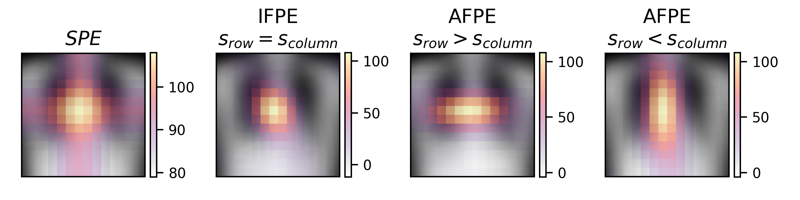

# Anisotropic Fourier Features for Positional Encoding in Medical Imaging

Anisotropic Fourier Feature Positional Encoding (AFPE) is a generalization of Isotropic Fourier Feature Positional Encoding that incorporates anisotropic, class-specific, and domain-specific spatial dependencies.
**AFPE has one hyperparameter for every dimension. Explore their effect [here](https://nabja.github.io/afpe/)!**

## Method Overview

**AFPE captures directional spatial dependencies more effectively than Sinusoidal Positional Encoding (SPE) and Isotropic Fourier Feature Positional Encoding (IFPE). Shown are dot product similarity maps on a Vision Transformer-style patch grid, with similarities computed relative to the central patch.**

## Installation
To run the code in this repo create a conda environment and install the dependencies using the following commands:
```bash
conda env create -f environment.yml # Creates conda environment named 'posenc'
conda activate posenc # Activates the conda posenc environment
python setup.py install # Installs this package
```

## Generating the results
**Important:** Berfore you start, make sure ./results/chestx_predictions.7z is unpacked and you have the ./results/chestx_predictions.csv file.  

- **Minimal example**  
For a minimal example to generate the results in the table above, run: ```bash python ./generate_results.py ```
This script only requires torch, numpy, pandas and torchmetrics (1.5.2) to be installed!

- **More results exploration**  
For more in depth exploration of the results and plots in the paper, follow the notebooks in the `notebooks` folder:
    - [Figures](notebooks/figures.ipynb)
    - [ChestX results](notebooks/ChestX.ipynb)
    - [OrganMNIST3D results](notebooks/OrganMNIST3D.ipynb)
    - [EchoNet-Dynamic results](notebooks/echonet.ipynb)
    - [Feret diameter prediction results](notebooks/feret_prediction.ipynb)

**Implementation of proposed method**  
This publication introduces Anisotropic Fourier Feature Positional Encodings (AFPE). The implementation of this positional encoding as well as all other positional encodings can be found in the [positional_encodings.py](posenc/nets/positional_encodings.py) file.

## Pretrained models
Pretrained models can be downloaded from [https://huggingface.co/afpe/afpe](https://huggingface.co/afpe/afpe).
To load a pretrained model use the following code:
```python
# Loading model for EchoNet-Dynamic regression task
from posenc.modules.video_regression import VideoViTModule
model = VideoViTModule.load_from_checkpoint(model_path, map_location=torch.device(DEVICE))

# Loading model for ChestX multi-label classification task
from posenc.modules.vision_transformer import ViTMultiClsModule
model = ViTMultiClsModule.load_from_checkpoint(model_path, map_location=torch.device(DEVICE))
```

## Training a model from scratch
To train a model like in the this publication you need to:
1. Download dataset
    The datasets used in this study are publicly available and can be accessed through the following links: 
    - NIH Chest X-ray:  https://cloud.google.com/healthcare-api/docs/resources/public-datasets/nih-chest
    - MedMNIST:  https://medmnist.com/
    - EchoNet-Dynamic:  https://echonet.github.io/dynamic/index.html

    **Important:** After downloading the datasets change the *ROOT* variable in [posenc/datasets/chestx.py](posenc/datasets/chestx.py) and [posenc/datasets/echonet.py](posenc/datasets/echonet.py) to the path where the datasets are stored!

2. Preprocess the dataset
    ChestX preprocessing includes (see [script](posenc/datasets/chestx.py)):
    - Resizing the images to 224x224
    - Normalizing the images

    EchoNet preprocessing includes (see [script](posenc/datasets/echonet.py)):
    - Grayscale video
    - Normalizing the videos

3. Training
    - To train any of the models in the paper, you can run the [train.py](posenc/train.py) script.
    Use ```posenc/train.py --help``` to view all options.

    - Example to run the EchoNet-Dynamic regression task with the AFPE: ```bash python posenc/train.py --task echonetreg --positional_encoding isofpe ```

    - Example to run the ChestX multi-label classification task with the AFPE: ```bash python posenc/train.py --task chestxmulti --positional_encoding isofpe```
